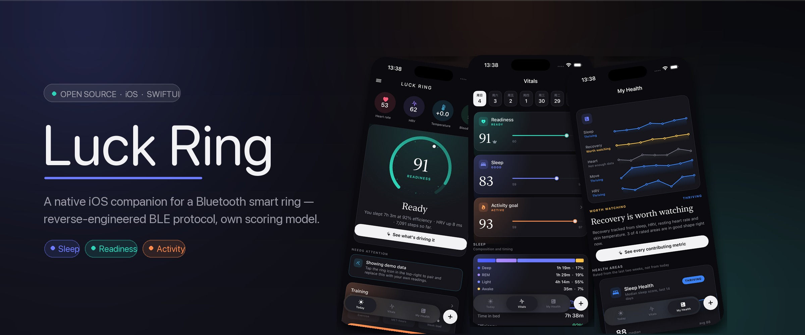
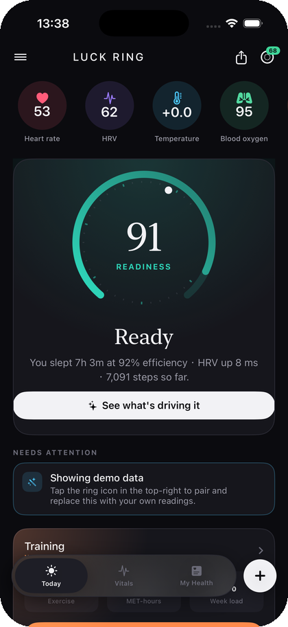
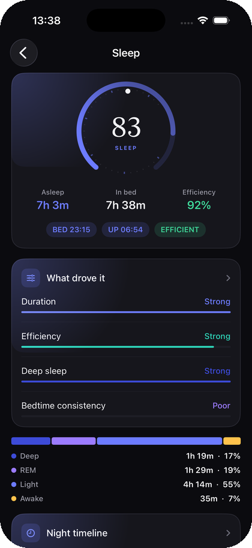
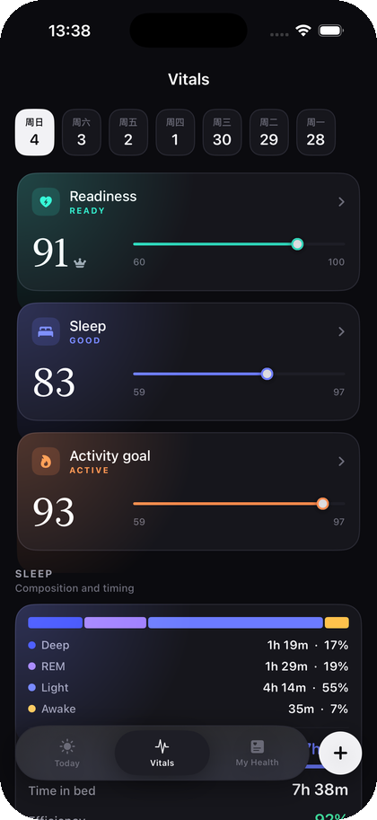
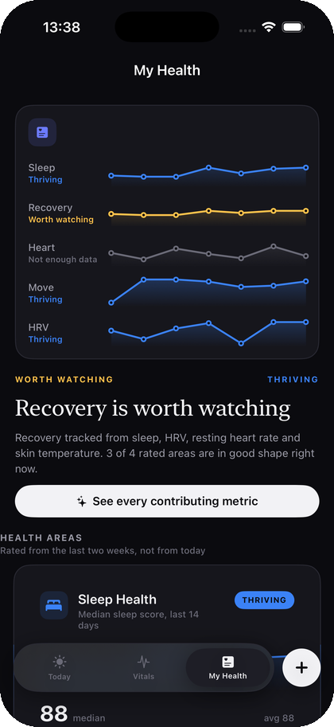
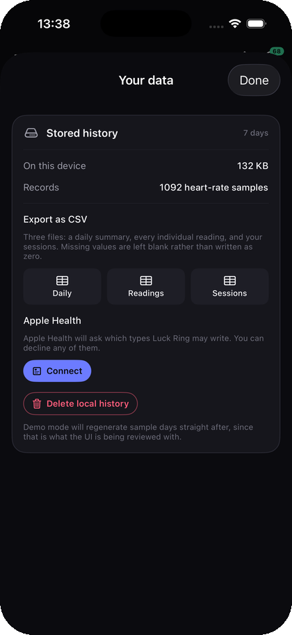

<div align="center">



# Luck Ring

**一款面向蓝牙智能戒指的原生 iOS App，构建在 Coolwear 闭源 BLE SDK 之上。**

[](https://github.com/EazyLee30/luck-ring/actions/workflows/ci.yml)
[](https://swift.org)
[](https://developer.apple.com/ios/)
[](https://developer.apple.com/xcode/)
[](#license)
[](https://github.com/EazyLee30/luck-ring/stargazers)
[](https://github.com/EazyLee30/luck-ring/network/members)
[](https://github.com/EazyLee30/luck-ring/commits/main)

[English](README.md) · **简体中文**

</div>

---

<div align="center">

| 今日 | 睡眠详情 | 生命体征 |
|:---:|:---:|:---:|
|  |  |  |

| 我的健康 | 你的数据 | |
|:---:|:---:|:---:|
|  |  |

</div>

<div align="center"><sub>三个 tab，沿用健康类 App 的通用信息架构 —— 截图来自 demo target，不需要戒指在场</sub></div>

---

## 这是什么

一个说着未公开 BLE 协议的戒指，一个以闭源 arm64 二进制形式发布的厂商 SDK，
以及一个不太能用的官方 App。这是一个在两者之上从零写起的 iOS 应用。

**今日** 顶部是圆形指标快捷入口，接一个大尺寸弧形仪表、衬线体标题 +
导语、需要关注的事项，以及戒指真实上报事件的时间线。**生命体征** 按健康领域分组
所有指标，顶部可切日期，每个分数配状态词和一个落在 min/max 轨道上的点。
**我的健康** 用四级评级给出长期趋势，**数据不够就明说「数据不足」而不是瞎猜**。
设备操作收在戒指图标后面。

界面上每个数字都来自戒指的真实数据。没有服务端、没有账号、没有埋点。
App 只跟戒指说话。

## 亮点

<table>
<tr>
<td width="50%">

**会自我解释的分数环**
<br><br>
睡眠 / 准备度 / 活动，各 100 分 —— 并且把每个分数由什么构成直接摊开给你看，
而不是藏在一个「了解更多」后面。

</td>
<td width="50%">

**从原始报文重建睡眠**
<br><br>
设备发来的是一堆扁平的状态跳变。会话由我们重新组装，
每个分数都能一路回溯到具体报文。

</td>
</tr>
<tr>
<td>

**能在模拟器里跑**
<br><br>
厂商 framework 只有 arm64 真机 slice，所以领域层放在协议之后，
由一个 demo target 灌入生成数据。

</td>
<td>

**对不确定性诚实**
<br><br>
只睡两晚得出的评级就是噪声，所以每个健康领域都写明自己的
数据门槛，没达标就拒绝给答案。

</td>
<td>

**原创设计系统**
<br><br>
`Editorial.swift` 里是基础组件 —— 弧形仪表、范围刻度、分段指示器、
斜纹进度条、编辑式卡片。是范式，不是逐像素临摹。

</td>
</tr>
<tr>
<td>

**114 个单元测试**
<br><br>
分数边界全空间扫描、单调性、退化输入、睡眠会话装配 ——
两个真 bug 就藏在这两处。

</td>
<td>

**完整抓包**
<br><br>
进出两个方向的每一帧都记录成 JSONL，
可以通过「文件」App 直接从设备取走。

</td>
</tr>
</table>

## 快速开始

```bash
brew install xcodegen
cd ios && xcodegen generate
```

**迭代 UI** —— demo target，模拟器，不需要戒指：

```bash
xcodebuild -project LuckRing.xcodeproj -scheme LuckRingDemo \
  -destination 'platform=iOS Simulator,name=iPhone 17 Pro' build
```

**连真戒指跑** —— device target：

```bash
xcodebuild -project LuckRing.xcodeproj -scheme LuckRing \
  -destination 'generic/platform=iOS' build
```

然后打开 `ios/LuckRing.xcodeproj`，在 `LuckRing` target 上选自己的签名 team，
装到真机运行。首次配对需要点一下戒指屏幕确认。

## 两个 target，以及为什么

`BluetoothLibrary.framework` 的 `LC_BUILD_VERSION` 是
`platform 2 (IOS)`、`minos 13.0`、`sdk 26.0`，而且 `lipo` 确认它**不是 fat
二进制** —— 里面没有模拟器 slice。所以 device target 直接把
`SUPPORTED_PLATFORMS` 设成 `iphoneos`，不给模拟器编译的机会。

| Target | Framework | 运行位置 | 用途 |
|---|:---:|---|---|
| `LuckRingDemo` | ✗ | 模拟器 | UI 迭代、SwiftUI 预览、截图、测试宿主 |
| `LuckRing` | ✓ | 真机（arm64） | 真实戒指，embed 并签名 |

领域层是纯 Foundation、藏在 `RingBridge` 协议后面，
所以 demo 数据和真实数据驱动的是**同一套**视图。

## 数据到底怎么流

这是关于这个 SDK 最重要的一件事，也是能让人白白折腾好几天的点：

| 类型 | 怎么拿 |
|---|---|
| **可请求** —— 设备信息、电量、闹钟、用户档案 | `CE_RequestDevInfoCmd`、`CE_RequestBatteryCmd` 等 |
| **只能推** —— 步数、睡眠、心率历史、HRV、体温 | **没有对应的请求命令**。发 `CE_SensorCmd(onoff: 1)`，设备自己上传 |

所以「读点数据」主要靠**保持 sensor 开关打开**，而不是发一堆命令。
`DeviceRingBridge.postPairHandshake` 在配对完成后会自动打开，
Ring 页面也提供了手动开关。

睡眠发来的是 `(时间戳, 阶段)` 跳变而不是会话。
`SleepSession.assemble` 负责重建 —— 取**最后一个** `SLEEP_WAKEUP`
作为会话结束，因为入睡几分钟后通常会有一次短暂醒来。

## 正确性

分数引擎和睡眠装配是最可能「悄悄算错」的两块，而且都不需要硬件。
`ios/Tests` 覆盖它们，CI 每次 push 都跑：

```bash
cd ios && xcodegen generate
xcodebuild -project LuckRing.xcodeproj -scheme LuckRingDemo \
  -destination 'platform=iOS Simulator,name=iPhone 17 Pro' test
```

```
Executed 114 tests, with 0 failures
```

写测试的过程揪出了 **4 个真 bug**，全部已修并补了回归测试：

- **跨夜的睡眠永远装不出来。** 23:30 入睡的夜晚，午夜之后的阶段被归到了
  *第二天*，于是会话从未建成，每一晚都显示「没有数据」。
- **电量和固件版本被丢弃。** `ingest` 跳过了所有没有时间戳的记录，
  而设备级记录全都没有时间戳。
- **杂散跳变会造出假会话。** 装配函数没有以 `SLEEP_START` 为锚点，
  一串以 awake 开头的序列就能造出一个会话。
- **没睡眠记录就没有基线。** 只有 HRV 和心率、还没攒出睡眠会话的用户，
  永远拿不到基线。

## 评分模型

Oura 的算法是专有且未公开的。下面是我们**自己的**启发式模型，
并且是跟一个滚动 7 天的 `Baseline` 比，
所以分数对每个佩戴者有意义，而不是对某个总体有意义。

| 分数 | 构成 |
|---|---|
| **睡眠** | 时长 40 · 效率 25 · 深睡区间 20 · 入睡时间一致性 15 |
| **准备度** | 睡眠 50 · HRV 25 · 静息心率 15 · 皮温偏差 10 |
| **活动** | 步数 50 · 卡路里 30 · 活动时长 20 |

不用设备也能验证分布和不变量：

```bash
cd ios
swiftc -O Sources/Shared/Models.swift Sources/Shared/Scores.swift \
  Sources/Shared/DemoData.swift Sources/Shared/SeededRNG.swift \
  Tools/ScoreReport/main.swift -o /tmp/score-report && /tmp/score-report
```

```
sleep scores: avg 78  min 49  max 85
readiness:    avg 78  min 42  max 92
activity:     avg 75  min 9   max 100
all sessions consistent ✓
```

## 协议笔记

从 `-[CE_K6Protocol constructData:funcType:cmdType:searialNumber:header:]`
反汇编得到：

```
10 字节头
  [0]      0
  [1]      1
  [2]      分包数
  [3]      (流水号 % 255) + 1
  [4]      cmdType
  [5]      funcType
  [6..7]   0
  [8..9]   uint16 body 长度

第 0 包  : 10 字节头 + 10 字节 body
第 n 包  : 1 字节序号   + 19 字节 body      （每帧 20 字节）
```

OTA / GPS 的 payload CRC 是 `crc_dspWithReg:dataCrc:` —— 多项式 `0x8005`、
高位优先、初始值由参数传入，也就是 CRC-16/CCITT。数据分帧本身**没有** CRC。

## 目录结构

```
ios/
  project.yml                  xcodegen 配置
  Sources/
    Shared/                    模型 · 评分 · 设计系统 · store
    Views/                     今日 / 趋势 / 戒指
    Device/                    绑定厂商 SDK 的 BLE bridge
    Demo/                      模拟器入口
    Previews/                  SwiftUI 预览
    Shared/Editorial.swift      设计系统基础组件
  Tools/ScoreReport/           离线的分数与不变量校验工具
    Shared/Workouts.swift       运动模型、MET 计算、自动识别
    Shared/DerivedMetrics.swift 派生指标（带免责说明）
    Shared/HistoryStore.swift   原子写入的 JSON 持久化
    Shared/MotionResearch.swift IMU 结论 + 报文捕获器
    Shared/AppGroup.swift       widget 快照 + CSV 导出
    Shared/HealthExport.swift   两个 target 共用的 HealthKit 接口
  Widget/                      桌面小组件（4 种尺寸）
  Tests/                       7 个套件共 114 个用例
scripts/make-readme-assets.py  重新生成 banner 与截图
SDK/                           厂商文档、头文件与 demo 工程
```

## 踩过的坑

- **快捷入口还不能拖拽排序** —— 目录和「至少三个」的约束已经建模，
  但手势没做。
- **首次配对要点一下戒指。** 保存过 UUID 之后（`saveConnectedUUid`），
  后续连接会自动配对。
- **同一时刻只允许一个 BLE 中心设备。** 先把厂商 App 关掉，否则戒指一直被占用。
- **`CE_ClearDataCmd` 会清掉戒指上存的历史数据。** 已经加了二次确认弹窗。
- 后台上传需要 `UIBackgroundModes: bluetooth-central`。
- 扫描过滤条件是 `version > 4 || isPairedSystem`，跟厂商 demo 一致。
- 戒指不会把 REM 作为独立阶段上报 —— `SleepStage.rem` 在模型里存在，
  但设备从来不发这个值。

## 真机 target 的构建前提

demo target 无需任何配置。真机 target 需要在开发者账号里开两项能力：

| 能力 | 用途 | 不开的后果 |
|---|---|---|
| HealthKit | 导出到 Apple Health | 按钮会如实显示框架不可用 |
| App Groups（`group.com.luckring.reader`） | widget 读取 app 写的快照 | widget 只显示占位数据 |

`project.yml` 已经在 `Support/LuckRing.entitlements` 里声明了两项。加到 App ID、
重新生成描述文件，真机即可签名。其余部分（含 BLE 后台模式）配置都在 spec 里。

## 路线图

- [x] 落地 XCTest 并接进 CI
- [ ] 历史数据落盘，重启 App 后不丢
- [ ] 完全绕开厂商 framework 的独立 BLE 客户端
- [x] 导出到 HealthKit
- [ ] 等固件暴露更多戒指专属指标
      （`DATA_TYPE_HISTORY_TEMP`、`DATA_TYPE_SET_VALUABLE_ASSISTANT`）

## 致谢与声明

- [`BluetoothLibrary.framework`](SDK/) 及 SDK 文档版权归
  **Coolwear / celink** 所有。本项目与其无隶属关系，也未获其背书。
  framework 二进制文件不入 git，详见 [`.gitignore`](.gitignore)。
- 视觉设计为本项目原创。本项目与 Oura 无隶属关系、未获背书，
  也不是从 Oura 衍生而来。整体信息架构沿用了健康类 App 的通用范式，
  而配色、字体、图标与每一行代码均为原创。
- 评分是我们自己的启发式模型，不是 Oura 的算法。

## 许可证

[MIT](LICENSE) —— 第三方声明见该文件末尾。